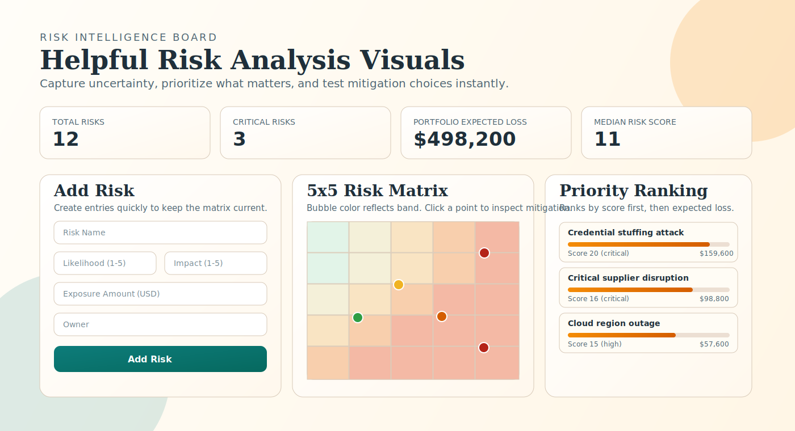

# Risk Lens: Helpful Risk Analysis Visuals

A lightweight static web app for interactive risk analysis. It is designed to run directly in the browser and publish cleanly on GitHub Pages.



## What it includes

- Editable risk register with likelihood, impact, owner, and dollar exposure
- Live 5x5 risk matrix with clickable risk bubbles
- Priority ranking view sorted by score and expected loss
- Mitigation planner for before/after residual-risk simulation
- Portfolio summary cards for total risk, critical count, expected loss, and median score

## Run locally

1. Clone the repository.
2. Open `index.html` in your browser.

Optional local static server:

```bash
npx serve .
```

## Publish on GitHub Pages

1. Push the repository to GitHub.
2. In repository settings, open **Pages**.
3. Set source to **Deploy from a branch**.
4. Select branch `main` and folder `/ (root)`.
5. Save, then open the generated Pages URL.

## Notes

- This project is frontend-only (HTML/CSS/JavaScript).
- No Python runtime is required.
